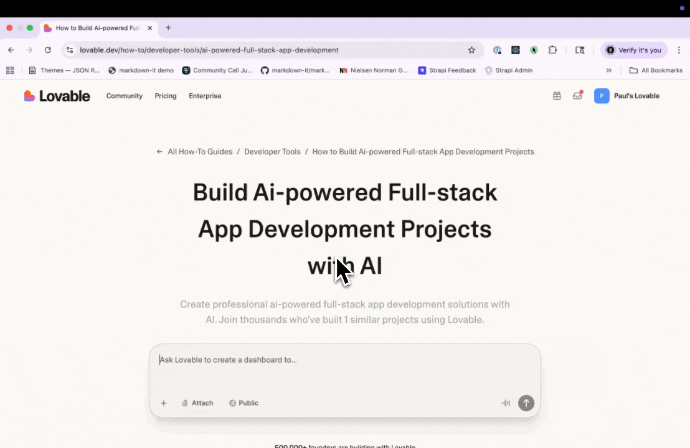
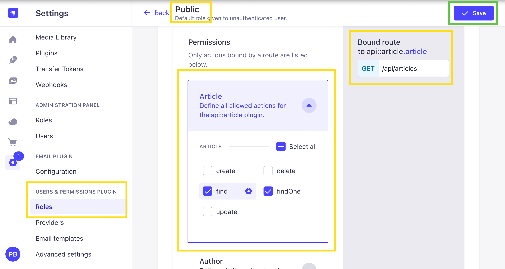
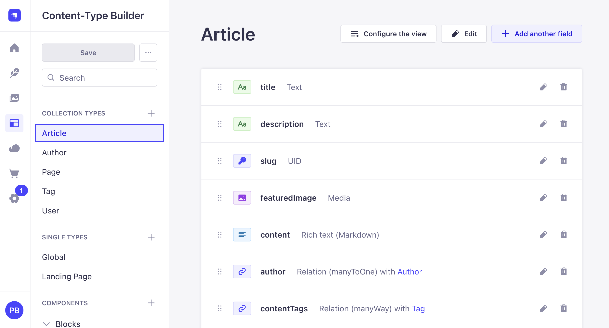
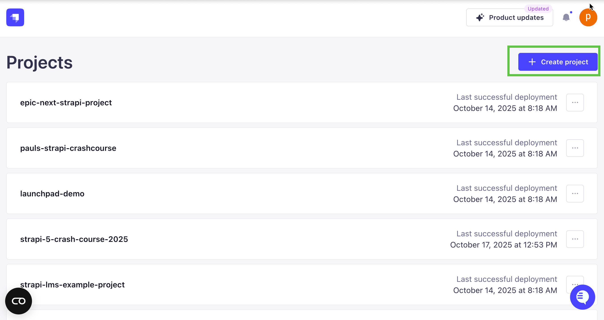
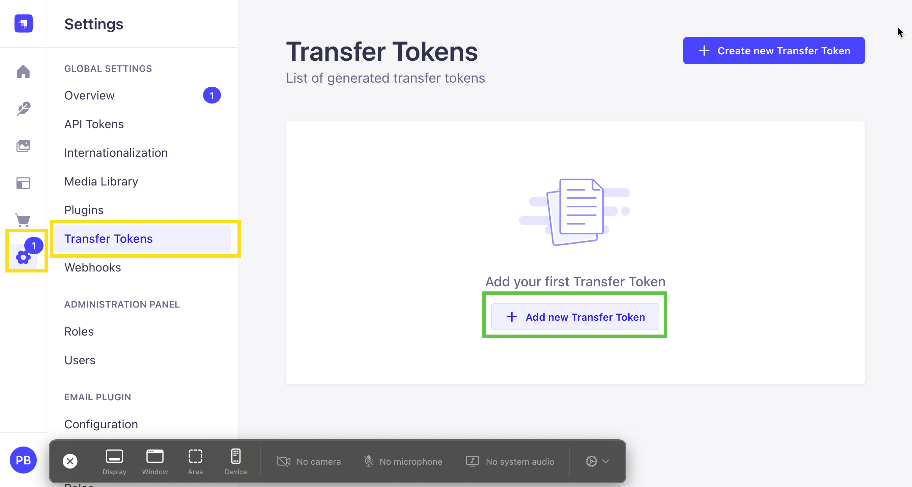

# How To Build a Frontend with Lovable.dev for Your Strapi Backend

AI tools like [Lovable.dev](https://lovable.dev) and [Claude Code](https://www.anthropic.com/claude-code) can help you build projects faster than ever before. But here's what I've learned: they're not magic. You still need to understand what you're building, know your data structure, grasp the problems you're solving, and be familiar with your tech stack. And yes—you still need to know how to code.

These tools are powerful, but they sometimes make up information or create errors. The more you understand your project's structure and how these AI tools work, the better results you'll get.

In this guide, I'll walk you through building a frontend with Lovable.dev that connects to a Strapi backend. We'll cover a lot of ground, and I'll dive deeper into specific topics in future posts.

## What is Lovable.dev?

Lovable.dev is a browser-based AI development platform that turns your ideas into working web applications. You simply describe what you want in plain English, and Lovable writes the code for you. It's similar to V0 by Vercel, but includes extra features like instant preview, version control, and easy deployment—all in one place.

**Key features:**

- **AI-assisted development**: Tell Lovable what you want to build, and it creates React components, pages, and even backend logic for you.
- **Instant preview**: See your application come to life in real-time. Make changes with follow-up instructions and watch them happen instantly.
- **Easy deployment**: Push your finished app to production with just a few clicks.
- **Collaborative workflow**: Work side-by-side with the AI, reviewing and guiding the code as it's created.

## What is Vibe Coding?

Vibe coding is a relaxed, creative way of building applications where you use AI tools to work in a natural flow.

Instead of writing code line by line from scratch, you describe what you want to build and let the AI do the heavy lifting. You then guide and refine the AI's work step by step.



The "vibe" is all about keeping momentum—trying ideas quickly without getting stuck on setup or syntax details.

**Key characteristics:**

- **AI as your coding partner**: The AI tool (like Lovable.dev or V0) acts like a team member, creating React components, pages, styles, and API connections based on your instructions.
- **Speed matters**: The goal is getting a working prototype fast—turning ideas into code in minutes or hours instead of days.
- **Build piece by piece**: You don't need to have everything planned out perfectly. Just build one feature at a time, refining as you go.
- **You're still in charge**: The AI doesn't do everything perfectly. Think of it like working with a junior developer—you get speed and productivity, but you need to review and guide the work carefully.

**What is Claude Code?** (by Anthropic) A command-line AI assistant that can read, write, debug, and run code across your entire project—with you guiding the way.

## Why Use Lovable.dev with Strapi?

When building an application that manages content, you have three main approaches:

1. **Frontend first** - Design your user interface, then build the backend to support it
2. **Backend first** - Set up your data and API, then build the frontend to display it
3. **Both at once** - Build frontend and backend simultaneously (this often leads to mismatches and extra work)

**For this tutorial, we're starting with the backend using Strapi. Here's why that works best:**

### Benefits of starting with Strapi:

- **Your data shapes your design**: When you know what content you have, it's easier to decide what components and pages you need
- **Catch errors early**: TypeScript types generated from your API help prevent bugs before they happen
- **Work with real content**: Test your app with actual data instead of fake placeholders
- **AI-friendly documentation**: Strapi creates an OpenAPI spec that tells AI tools exactly how your API works
- **Teamwork made easy**: Content editors can start adding material while you're building the frontend

### Downsides to consider:

- **Planning required**: You need to think through your data structure before you see anything visual
- **Risk of overthinking**: It's tempting to add extra fields and connections you might not actually need
- **Delayed gratification**: You won't see the interface come together until later

Even with these tradeoffs, starting with Strapi gives you the strongest foundation for building with AI tools—especially when you use OpenAPI specifications.

## What is OpenAPI and Why Should You Use It?

**OpenAPI Specification (formerly called Swagger)** is a standard way to describe how your API works. Think of it as a detailed instruction manual that explains:

- What endpoints are available and what they do (GET, POST, PUT, DELETE, etc.)
- What parameters each endpoint accepts and what type of data they expect
- What data comes back in responses
- How authentication works
- What error messages you might get

Here's a simple example of what an OpenAPI spec looks like:

```yaml
openapi: 3.0.0
paths:
  /api/articles:
    get:
      summary: Get all articles
      responses:
        "200":
          description: Success
          content:
            application/json:
              schema:
                type: object
                properties:
                  data:
                    type: array
                    items:
                      $ref: "#/components/schemas/Article"
components:
  schemas:
    Article:
      type: object
      properties:
        id:
          type: integer
        title:
          type: string
        content:
          type: string
```

### Why OpenAPI helps when building with AI:

1. **Stops the AI from making things up**: The AI gets exact details about your API instead of guessing
2. **Creates matching code**: The AI generates TypeScript types that perfectly align with your backend
3. **Makes accurate requests**: The AI knows exactly which endpoints exist, what data they need, and what they send back
4. **Works as documentation**: Both humans and AI can read and understand the specification
5. **Catches mistakes**: You can check if your requests and responses match what's expected

### Generating OpenAPI Spec in Strapi

Strapi makes creating an OpenAPI specification simple. Just run one command:

```bash
# Generate OpenAPI spec
npx strapi openapi generate

# This creates an openapi.json file in your project root
```


This file contains everything about your API—all your content types, components, and endpoints with their exact data structures. It's exactly what AI tools like Lovable.dev need to understand your backend.

**Pro tip:** I use the **OpenAPI** extension in VS Code to browse through the endpoints visually.


We'll explore how to use this specification in more detail as we go through the tutorial.

## Let's Start: Building a Frontend with Lovable.dev for Your Strapi Backend

Now we'll walk through building a frontend with Lovable.dev that connects to a Strapi backend. I'll show you each step along the way.

### Before We Begin

Let's check if you have what you need:

- ✅ Do you have a Strapi project? (Don't worry if you don't—we'll set one up)
- ✅ Have you created content types in Strapi? ( We will use ours from our demo project)
- ✅ Can you access your Strapi API? (Either running locally or deployed online)


### Step 1: Set Up Your Strapi Project

Don't have a Strapi project yet? No problem! We'll use a pre-built one from my Strapi Crash Course. If you want to learn how the backend was created, check out the video tutorial.

// TODO: embed video here later

Since this guide focuses on the frontend, let's just grab the ready-made backend project.

```bash
git clone https://github.com/PaulBratslavsky/pauls-strapi-crashcourse server
```

Now that we have our project, let's change directories into the `server` folder:

```bash
cd server
```

Next, install all the dependencies. You can use either `yarn` or `npm`:

```bash
yarn
```

or

```bash
npm install
```

Once the dependencies are installed, create a `.env` file in the root of the project. You can copy the configuration from the `.env.example` file that's already included:

```bash
HOST=0.0.0.0
PORT=1337
APP_KEYS="toBeModified1,toBeModified2"
API_TOKEN_SALT=tobemodified
ADMIN_JWT_SECRET=tobemodified
TRANSFER_TOKEN_SALT=tobemodified
JWT_SECRET=tobemodified
ENCRYPTION_KEY=tobemodified
```

Replace each placeholder string with a unique value of your choice.

Now seed the project with initial data by running:

```bash
yarn strapi import -f ./seed-data.tar.gz
```

When prompted to confirm, type `y` for Yes:

```bash
➜  server git:(main) yarn strapi import -f ./seed-data.tar.gz
yarn run v1.22.22
$ strapi import -f ./seed-data.tar.gz
? The import will delete your existing data! Are you sure you want to proceed? (y/N) y
```

And type `y` for the following:

```bash
[2025-10-24 10:09:33.381] warn: (Schema Integrity) admin::session does not exist on source
? There are differences in schema between the source and destination, and the data listed above will be lost. Are you sure you want
to continue? (y/N)
```

This is just a warning about a schema mismatch between what's generated locally versus what's in the seed file. It's safe to ignore.

Once the import finishes, you should see the following output:

```bash
Starting import...
✔ entities: 55 transferred (size: 46.7 KB) (elapsed: 64 ms) (729.6 KB/s)
✔ assets: 8 transferred (size: 300 KB) (elapsed: 21 ms) (13.9 MB/s)
✔ links: 171 transferred (size: 32.2 KB) (elapsed: 11 ms) (2.9 MB/s)
✔ configuration: 47 transferred (size: 135.4 KB) (elapsed: 8 ms) (16.5 MB/s)
┌─────────────────────────────────────────┬───────┬───────────────┐
│ Type                                    │ Count │ Size          │
├─────────────────────────────────────────┼───────┼───────────────┤
│ entities                                │    55 │      46.7 KB  │
├─────────────────────────────────────────┼───────┼───────────────┤
│ -- api::article.article                 │    12 │ (    22.3 KB) │
├─────────────────────────────────────────┼───────┼───────────────┤
│ -- api::author.author                   │     2 │ (     534 B ) │
├─────────────────────────────────────────┼───────┼───────────────┤
│ -- api::global.global                   │     2 │ (     3.3 KB) │
├─────────────────────────────────────────┼───────┼───────────────┤
│ -- api::landing-page.landing-page       │     2 │ (     7.9 KB) │
├─────────────────────────────────────────┼───────┼───────────────┤
│ -- api::page.page                       │     4 │ (     1.6 KB) │
├─────────────────────────────────────────┼───────┼───────────────┤
│ -- api::tag.tag                         │     3 │ (     820 B ) │
├─────────────────────────────────────────┼───────┼───────────────┤
│ -- plugin::i18n.locale                  │     1 │ (     253 B ) │
├─────────────────────────────────────────┼───────┼───────────────┤
│ -- plugin::upload.file                  │     8 │ (     4.1 KB) │
├─────────────────────────────────────────┼───────┼───────────────┤
│ -- plugin::upload.folder                │     2 │ (     519 B ) │
├─────────────────────────────────────────┼───────┼───────────────┤
│ -- plugin::users-permissions.permission │    16 │ (     4.4 KB) │
├─────────────────────────────────────────┼───────┼───────────────┤
│ -- plugin::users-permissions.role       │     2 │ (     656 B ) │
├─────────────────────────────────────────┼───────┼───────────────┤
│ -- plugin::users-permissions.user       │     1 │ (     464 B ) │
├─────────────────────────────────────────┼───────┼───────────────┤
│ assets                                  │     8 │       300 KB  │
├─────────────────────────────────────────┼───────┼───────────────┤
│ -- .avif                                │     3 │ (   292.1 KB) │
├─────────────────────────────────────────┼───────┼───────────────┤
│ -- .svg                                 │     5 │ (     7.9 KB) │
├─────────────────────────────────────────┼───────┼───────────────┤
│ links                                   │   171 │      32.2 KB  │
├─────────────────────────────────────────┼───────┼───────────────┤
│ configuration                           │    47 │     135.4 KB  │
├─────────────────────────────────────────┼───────┼───────────────┤
│ Total                                   │   281 │     514.2 KB  │
└─────────────────────────────────────────┴───────┴───────────────┘
Import process has been completed successfully!
✨  Done in 15.24s.
```

Now we're ready to start our Strapi project. Run this command in your `server` directory:

```bash
yarn dev
```

Once our project starts, you can navigate to it at [http://localhost:1337](http://localhost:1337)

You will be greeted with the following screen. Let's go ahead and create our first **Admin** user.


Once you create your user, you will be greeted by the Strapi dashboard.


Great! Now that the project is running, let's look at what content types we have available.

Here's how the articles content type works and how to get its data from the API:


The Strapi backend has several content types in `/server/src/api`. For this tutorial, we'll build three main pages in Lovable:

1. **Landing Page** - A flexible homepage built with customizable content blocks
2. **Articles Listing Page** - Shows all your published articles
3. **Article Detail Page** - Displays a single article with all its content

Here are the main content types we'll work with:

**Global Content Type** (`api::global.global`):

- title (Text)
- description (Text)
- banner (Component - layout.banner)
- header (Component - layout.header)
- footer (Component - layout.footer)

**Article Content Type** (`api::article.article`):

- title (Text)
- description (Text)
- slug (UID based on title)
- content (Rich Text)
- featuredImage (Media - Single)
- author (Relation to Author - manyToOne)
- contentTags (Relation to Tag - oneToMany)
- blocks (Dynamic Zone - for flexible content sections)
- relatedArticles (Relation to Article - oneToMany)

**Landing Page Content Type** (`api::landing-page.landing-page`):

- title (Text)
- description (Text)
- blocks (Dynamic Zone with components):
  - Hero
  - Section Heading
  - Card Grid
  - Content with Image
  - Markdown
  - Person Card
  - FAQs
  - Newsletter
  - Featured Articles

**Author Content Type** (`api::author.author`):

- name (Text)
- bio (Text)
- avatar (Media - Single)
- articles (Relation to Article - oneToMany)

**Tag Content Type** (`api::tag.tag`):

- name (Text)
- slug (UID based on name)

### Enabling Public API Access

The seed data we imported already has public access set up, so anyone can read your content without logging in. If you're building your own Strapi project from scratch, you'll need to enable this yourself.

Here's how to allow public access:

1. Go to **Settings → Users & Permissions Plugin → Roles → Public**
2. Open each content type (Article, Landing Page, Author, Tag)
3. Check the boxes next to `find` and `findOne`
4. Click **Save**



### The API Endpoints You'll Use

We'll work with four main endpoints in this tutorial:

1. **Global Settings** (Single Type):
   **GET** [`http://localhost:1337/api/global`](http://localhost:1337/api/global)

   Gets your site-wide settings like header navigation, footer, and banner. You'll use this data on every page.

   

2. **Landing Page** (Single Type):
   **GET** [`http://localhost:1337/api/landing-page`](http://localhost:1337/api/landing-page)

   Gets your homepage content with all its customizable blocks.

   

3. **Articles List** (Collection Type):
   **GET** [`http://localhost:1337/api/articles`](http://localhost:1337/api/articles)

   Gets all your published articles with their authors, tags, and images.

   

4. **Single Article** (Collection Type):
   **GET** [`http://localhost:1337/api/articles?filters[slug][$eq]=why-java-script-is-still-the-most-popular-programming-language`](http://localhost:1337/api/articles?filters[slug][$eq]=why-java-script-is-still-the-most-popular-programming-language)

   Gets one specific article by its slug (the URL-friendly version of the title).

**Things to note:**

- The `filters[slug][$eq]` part is how Strapi filters data by specific field values
- All URLs use port `1337` (Strapi's default)
- You can test these URLs in your browser or with tools like Postman before building your frontend

### Step 2: Generate Your OpenAPI Specification

Now that your content types are set up, let's create the OpenAPI specification file. We talked about this earlier—now we'll actually do it.

```bash
# In your Strapi project directory
yarn strapi openapi generate
```

This creates a `specification.json` file with all your API details. Want to browse it visually? Install the [OpenAPI](https://marketplace.visualstudio.com/items?itemName=42Crunch.vscode-openapi) VS Code extension.


### Step 3: Deploy Strapi (Optional but Recommended)

While you can keep Strapi running locally, deploying it makes working with Lovable.dev much easier. We'll use [Strapi Cloud](https://strapi.io/cloud) which has a free tier.


But if you Want to keep Strapi running on your computer? You can use ngrok to create a temporary public URL:

```bash
# Install ngrok first from https://ngrok.com/download
# Then run this command to expose your local Strapi instance
ngrok http 1337
```

You'll get a public URL (like `https://abc123.ngrok.io`) that Lovable.dev can use to reach your local Strapi.

But I will cover the steps of how you can deploy your project to Strapi Cloud for free.

And you can choose witch path to take,

**Deploy to Strapi Cloud (Recommended)**

For a more permanent solution, let's deploy your project to Strapi Cloud for free:

Navigate to [Strapi Cloud](https://strapi.io/cloud) and create a new account if you don't already have one.


Once in your dashboard click on the create project button:



Choose the Free Plan:


Now select your account and project:


Now, let's name our Cloud project and select our region.

I will call mine `lovable-example` and pick `US East` region.


Finally click on **Create Project** button to deploy your project:


Once the deployment finishes, you'll be able to navigate to your Strapi instance and create your first admin user. Notice that we don't have any data yet—we can add data by using the transfer command.

First let's create Transfer Token in Strapi.

Navigate to Setting => Transfer Token and click on `Add new transfer token` button.



Now let's create our token:

- Name: initial transfer
- Token duration: 7 days
- Token type: full access


Now that we have our token and URL, we can use the CLI to transfer our data to Strapi Cloud.

Run the following command in your local `server` directory:

```bash
yarn strapi transfer
```

When prompted, enter your project URL (in my case it was `https://inviting-cheese-ce66d3b9e0.strapiapp.com/admin`). Make sure to include the `/admin` path.

Then you'll be prompted to enter your transfer token, and finally type `y` to confirm the transfer.

```bash
➜  server git:(main) yarn strapi transfer
yarn run v1.22.22
$ strapi transfer
ℹ️  Data transfer documentation: https://docs.strapi.io/dev-docs/data-management/transfer
ℹ️  No transfer configuration found in environment variables
   → Add STRAPI_TRANSFER_URL and STRAPI_TRANSFER_TOKEN environment variables to make the transfer process faster for future runs
? Choose transfer direction: Push local data to remote Strapi
? Enter the URL of the remote Strapi instance to send data to:
https://inviting-cheese-ce66d3b9e0.strapiapp.com/admin
? Enter the transfer token for the remote Strapi destination:
[hidden]
? The transfer will delete existing data from the remote Strapi! Are
 you sure you want to proceed? Yes
Starting transfer...
✔ entities: 58 transferred (size: 48.1 KB) (elapsed: 4207 ms) (11.4 KB/s)
✔ assets: 8 transferred (size: 300 KB) (elapsed: 1964 ms) (152.7 KB/s)
✔ links: 174 transferred (size: 32.6 KB) (elapsed: 1987 ms) (16.4 KB/s)
✔ configuration: 48 transferred (size: 141.8 KB) (elapsed: 1318 ms) (107.6 KB/s)
┌─────────────────────────────────────────┬───────┬───────────────┐
│ Type                                    │ Count │ Size          │
├─────────────────────────────────────────┼───────┼───────────────┤
│ entities                                │    58 │      48.1 KB  │
├─────────────────────────────────────────┼───────┼───────────────┤
│ -- admin::session                       │     3 │ (     1.4 KB) │
├─────────────────────────────────────────┼───────┼───────────────┤
│ -- api::article.article                 │    12 │ (    22.3 KB) │
├─────────────────────────────────────────┼───────┼───────────────┤
│ -- api::author.author                   │     2 │ (     534 B ) │
├─────────────────────────────────────────┼───────┼───────────────┤
│ -- api::global.global                   │     2 │ (     3.3 KB) │
├─────────────────────────────────────────┼───────┼───────────────┤
│ -- api::landing-page.landing-page       │     2 │ (     7.8 KB) │
├─────────────────────────────────────────┼───────┼───────────────┤
│ -- api::page.page                       │     4 │ (     1.6 KB) │
├─────────────────────────────────────────┼───────┼───────────────┤
│ -- api::tag.tag                         │     3 │ (     820 B ) │
├─────────────────────────────────────────┼───────┼───────────────┤
│ -- plugin::i18n.locale                  │     1 │ (     253 B ) │
├─────────────────────────────────────────┼───────┼───────────────┤
│ -- plugin::upload.file                  │     8 │ (     4.1 KB) │
├─────────────────────────────────────────┼───────┼───────────────┤
│ -- plugin::upload.folder                │     2 │ (     519 B ) │
├─────────────────────────────────────────┼───────┼───────────────┤
│ -- plugin::users-permissions.permission │    16 │ (     4.4 KB) │
├─────────────────────────────────────────┼───────┼───────────────┤
│ -- plugin::users-permissions.role       │     2 │ (     656 B ) │
├─────────────────────────────────────────┼───────┼───────────────┤
│ -- plugin::users-permissions.user       │     1 │ (     464 B ) │
├─────────────────────────────────────────┼───────┼───────────────┤
│ assets                                  │     8 │       300 KB  │
├─────────────────────────────────────────┼───────┼───────────────┤
│ -- .avif                                │     3 │ (   292.1 KB) │
├─────────────────────────────────────────┼───────┼───────────────┤
│ -- .svg                                 │     5 │ (     7.9 KB) │
├─────────────────────────────────────────┼───────┼───────────────┤
│ links                                   │   174 │      32.6 KB  │
├─────────────────────────────────────────┼───────┼───────────────┤
│ configuration                           │    48 │     141.8 KB  │
├─────────────────────────────────────────┼───────┼───────────────┤
│ Total                                   │   288 │     522.5 KB  │
└─────────────────────────────────────────┴───────┴───────────────┘
Transfer process has been completed successfully!
✨  Done in 76.51s.
➜  server git:(main)

```

You should now see your data in your Strapi Cloud instance. If you navigate to the `api/articles` endpoint, you should see your API data.

**Example:** [https://inviting-cheese-ce66d3b9e0.strapiapp.com/api/articles](https://inviting-cheese-ce66d3b9e0.strapiapp.com/api/articles)

Your API is now live and accessible! Whether you used ngrok or Strapi Cloud, we're ready to build the frontend.

Why did we spend time setting up the backend first? Because now Lovable can build your frontend based on real API responses and actual data structures. This means more accurate code and fewer errors.


### Step 4: Prepare Your Context for Lovable.dev

Before jumping into Lovable.dev, gather the following:

1. **Your OpenAPI specification** (specification.json file)
2. **A sample API response** from an endpoint like `/api/articles`
3. **Your design preferences** (color scheme, layout style, component library preferences)

### Step 5: Craft Your Prompt for Lovable.dev

**Two Ways to Prompt**

We're starting with a **one-shot approach**—giving Lovable everything it needs in one big prompt. This approach can be limited by the context window and something to keep in mind.

**One-Shot Prompting Benefits:**
- Fast initial setup with a working foundation
- All requirements considered together from the start
- Good for setting up the overall structure
- Gives you a complete starting point

**One-Shot Prompting Drawbacks:**
- Can produce generic code that needs refinement
- Might miss important details or edge cases
- Harder to spot problems when everything appears at once
- AI might make things up when juggling too many requirements

**The Better Way: Iterative Prompting**

Breaking your project into small, focused prompts works best:
1. Start with basic layout and navigation
2. Add API connections
3. Build one feature at a time (search, pagination, etc.)
4. Test after each addition
5. Refine based on what you see

**Why this approach wins:**
- You can review each piece of code as it's created
- Problems like excessive API calls are easier to spot
- You can give specific feedback and corrections
- The final code is cleaner and easier to maintain

**Our Strategy:**

We'll use a two-pronged approach to show you both methods in action:

**Approach 1: Detailed One-Shot with Verification Checkpoints**

First, we'll use a comprehensive prompt that includes mandatory verification phases. This isn't a traditional "one-shot" where you paste and forget—instead, it has built-in checkpoints that force the AI to:
1. Fetch and show you actual API field names before writing code
2. Create TypeScript interfaces with verification tables
3. Wait for your confirmation at each critical phase

This approach gives you a working foundation quickly while ensuring the AI doesn't make assumptions about your API structure. Traditional one-shot prompting (without checkpoints) often leads to errors because the AI makes assumptions—but by adding verification phases, we get the speed of one-shot prompting with built-in quality control.

**Approach 2: Iterative Small Prompts**

After seeing how the verification checkpoint method works, we'll rebuild the same project using small, focused prompts. This template-driven approach involves:
1. Identifying requirements (one feature at a time)
2. Reviewing API responses for just that feature
3. Building and testing incrementally
4. Creating a todo list to track progress

**Why Learn Both Methods?**

By walking through both approaches, you'll understand:
- When to use comprehensive prompts with checkpoints (initial project setup, complex data structures)
- When to use iterative prompts (adding features, debugging, refining specific components)
- How to prevent AI from assuming or inventing field names regardless of which method you choose 

**Understanding the Strapi Client SDK**

Before we write our prompt, let's talk about the Strapi Client SDK. This official package ([@strapi/client](https://github.com/strapi/client)) makes working with Strapi APIs easier and safer.

It provides simple methods for handling API requests, filtering data, managing pagination, and loading related content.

**Basic setup example:**

```typescript
import { strapiClient } from '@strapi/client';

// Initialize the Strapi client
const client = strapiClient({
  baseURL: 'https://inviting-cheese-ce66d3b9e0.strapiapp.com',
  // No authentication needed for public endpoints
});

// 1. Fetch Global settings (single type)
const globalData = await client.single('global').find();
// Returns: { data: { id, documentId, attributes: { title, description, banner, header, footer } } }

// 2. Fetch Landing Page (single type)
const landingPage = await client.single('landing-page').find();
// Returns: { data: { id, documentId, attributes: { title, description, blocks: [...] } } }

// 3. Fetch all Articles with pagination
const articles = await client.collection('articles').find({
  pagination: { page: 1, pageSize: 6 }
});
// Returns: { data: [...], meta: { pagination: { page, pageSize, pageCount, total } } }

// 4. Search articles by title using filters (case-insensitive)
const searchResults = await client.collection('articles').find({
  filters: {
    title: { $containsi: 'javascript' }
  },
tha
// Common Strapi v5 filter operators:
// $eq: equals
// $ne: not equals
// $containsi: contains (case-insensitive)
// $startsWith: starts with
// $endsWith: ends with

// 5. Fetch single article by slug
const article = await client.collection('articles').find({
  filters: {
    slug: {
      $eq: 'why-java-script-is-still-the-most-popular-programming-language'
    }
  }
});
// Returns: { data: [{ id, documentId, attributes: {...} }], meta: {} }
// Note: Returns array with single item - extract first item: article.data[0]
```

**Important Note About Population:**

In our Strapi backend, we're already populating all content via a route middleware, so you don't need to add `populate` parameters in your frontend API calls. The only additional params you'll need are:
- **filter** - To filter articles by slug or other fields
- **pagination** - To implement pagination

**Example of our route middleware:**

Here's how we configured the articles route to automatically populate all relations:

```typescript
// server/src/api/article/routes/article.ts
import { factories } from '@strapi/strapi';

export default factories.createCoreRouter('api::article.article', {
  config: {
    find: {
      "middlewares": ["api::article.article-populate"]
    }
  }
});
```

**The populate middleware:**

```typescript
// server/src/api/article/middlewares/article-populate.ts
import type { Core } from "@strapi/strapi";

const populate = {
  featuredImage: {
    fields: ["url", "alternativeText"],
  },
  author: {
    populate: {
      image: {
        fields: ["url", "alternativeText"],
      },
      articles: {
        fields: ["documentId", "title"],
      },
    },
  },
  contentTags: true,
  blocks: {
    on: {
      "blocks.hero": {
        populate: { links: true, image: { fields: ["alternativeText", "url"] } },
      },
      "blocks.section-heading": true,
      "blocks.card-grid": { populate: { cards: true } },
      "blocks.content-with-image": {
        populate: { link: true, image: { fields: ["alternativeText", "url"] } },
      },
      "blocks.markdown": true,
      "blocks.person-card": {
        populate: { image: { fields: ["alternativeText", "url"] } },
      },
      "blocks.faqs": { populate: { faq: true } },
      "blocks.newsletter": true,
    },
  },
  relatedArticles: {
    populate: {
      featuredImage: { fields: ["alternativeText", "url"] },
      author: true,
    },
  },
};

export default (config, { strapi }: { strapi: Core.Strapi }) => {
  return async (ctx, next) => {
    ctx.query.populate = populate;
    await next();
  };
};
```

This means when you call `/api/articles`, all relations, images, and dynamic zone blocks are automatically populated—you don't need to add `?populate=deep` or specify individual fields.

While we'll include this SDK in our prompt to Lovable, you could also use a simple fetch wrapper or libraries like Axios. The SDK is recommended for larger projects but not strictly required.

## The Complete Lovable.dev Prompt

Below is the complete prompt you'll paste into Lovable.dev. It includes:
- Your actual Strapi backend URL and data structure
- Complete API utility functions and React Query hooks
- All requirements for pages, components, and features
- Strapi v5-specific constraints (direct field access, no populate params, filter syntax)

**Simply copy this entire prompt and paste it into Lovable.dev to generate your full blog frontend:**

```txt
You are a senior frontend developer experienced with TypeScript, React, and building dynamic content-driven websites that consume Strapi RESTful APIs.

TASK: Build a blog platform frontend that consumes a Strapi v5 backend API.

━━━━━━━━━━━━━━━━━━━━━━━━━━━━━━━━━━━━━━━━━━━━━━━━━━━━━━━━━━━━━━━━━━━
🛑 STOP - READ THIS ENTIRE SECTION BEFORE DOING ANYTHING 🛑
━━━━━━━━━━━━━━━━━━━━━━━━━━━━━━━━━━━━━━━━━━━━━━━━━━━━━━━━━━━━━━━━━━━

⚠️ MANDATORY PHASE 1: API DISCOVERY (DO THIS FIRST - NO EXCEPTIONS)

You MUST complete Phase 1 and wait for user confirmation before proceeding to Phase 2.

PHASE 1 REQUIREMENTS:

Step 1.1: Fetch ALL Live API Responses
Using the tool available to you, fetch and save the COMPLETE JSON responses from:
   - Global: https://inviting-cheese-ce66d3b9e0.strapiapp.com/api/global
   - Landing page: https://inviting-cheese-ce66d3b9e0.strapiapp.com/api/landing-page
   - Articles (paginated): https://inviting-cheese-ce66d3b9e0.strapiapp.com/api/articles?pagination[page]=1&pagination[pageSize]=6
   - Single article: https://inviting-cheese-ce66d3b9e0.strapiapp.com/api/articles?filters[slug][$eq]=why-java-script-is-still-the-most-popular-programming-language

Step 1.2: Read specification.json
   - If the user has uploaded a specification.json file, read it in full
   - Document the exact schema for each content type

Step 1.3: Create Field Name Reference Document
   - Create a document that lists EVERY field name you found in the actual API responses
   - Organize by content type (Global, Landing Page, Articles, Blocks, etc.)
   - Mark any nested objects and their field names

Step 1.4: Present Your Findings
   - Show me the field name reference document you created
   - DO NOT write any TypeScript interfaces yet
   - DO NOT create any components yet
   - WAIT for my confirmation before proceeding

Example of what you should present:

FIELD NAME REFERENCE FROM ACTUAL API RESPONSES:

Landing Page Blocks:
✓ blocks.section-heading:
  - heading: string
  - text: string (NOT "subheading")

✓ blocks.content-with-image:
  - heading: string
  - text: string
  - reversed: boolean (NOT "imagePosition")
  - links: array (NOT "buttons")
  - image: object

✓ blocks.person-card:
  - personName: string (NOT "name")
  - role: string
  - image: object

✓ blocks.faqs:
  - heading: string
  - faq: array (NOT "faqs")
    - question: string
    - answer: string

Article Fields:
✓ title: string
✓ description: string
✓ slug: string
✓ content: string
✓ featuredImage: object
  - url: string
  - alternativeText: string | null
✓ author: object
  - fullName: string (NOT "name")
  - bio: string
  - image: object
✓ contentTags: array
✓ blocks: array
✓ relatedArticles: array

━━━━━━━━━━━━━━━━━━━━━━━━━━━━━━━━━━━━━━━━━━━━━━━━━━━━━━━━━━━━━━━━━━━
🛑 CHECKPOINT 1: STOP HERE AND WAIT FOR USER CONFIRMATION 🛑
━━━━━━━━━━━━━━━━━━━━━━━━━━━━━━━━━━━━━━━━━━━━━━━━━━━━━━━━━━━━━━━━━━━

Do not proceed to Phase 2 until the user confirms:
✓ "The field names are correct - proceed to Phase 2"

⚠️ MANDATORY PHASE 2: TYPE DEFINITION WITH VERIFICATION

Only after receiving user confirmation from Phase 1:

Step 2.1: Create TypeScript Interfaces
   - Use ONLY the exact field names from your Phase 1 reference document
   - Include JSDoc comments noting the field name source: `/** From API: landing-page.blocks.section-heading.text */`

Step 2.2: Cross-Reference Verification
   - For each TypeScript interface, create a verification table showing:
     * The field name you used in the interface
     * The field name from the actual API response
     * Match status (✓ or ✗)

Example verification table you must present:

VERIFICATION: SectionHeadingBlock Interface

Interface Field | API Response Field | Match | Notes
----------------|--------------------| ------|-------
heading         | heading            | ✓     | Exact match
text            | text               | ✓     | Exact match (NOT subheading)
id              | id                 | ✓     | Exact match
__component     | __component        | ✓     | Exact match

Step 2.3: Document Assumptions
   - List ANY assumptions you made about:
     * Optional vs required fields
     * Field types (string, number, boolean, etc.)
     * Array vs single values
   - If you made zero assumptions, explicitly state: "Zero assumptions made - all types derived from actual API responses"

━━━━━━━━━━━━━━━━━━━━━━━━━━━━━━━━━━━━━━━━━━━━━━━━━━━━━━━━━━━━━━━━━━━
🛑 CHECKPOINT 2: STOP HERE AND WAIT FOR USER CONFIRMATION 🛑
━━━━━━━━━━━━━━━━━━━━━━━━━━━━━━━━━━━━━━━━━━━━━━━━━━━━━━━━━━━━━━━━━━━

Present:
1. All TypeScript interfaces
2. All verification tables
3. List of assumptions (or "zero assumptions" statement)

Wait for user confirmation:
✓ "Types are verified - proceed to Phase 3"

⚠️ MANDATORY PHASE 3: COMPONENT IMPLEMENTATION

Only after receiving user confirmation from Phase 2:

Step 3.1: Implement Components
   - Create all React components using the verified TypeScript interfaces
   - Add inline comments referencing the API field names: `{/* API field: block.text */}`

Step 3.2: Create Implementation Checklist
   - For each dynamic zone block component, confirm you're using the correct field names

Example checklist you must present:

IMPLEMENTATION CHECKLIST:

SectionHeadingBlock Component:
✓ Using block.heading (not block.title)
✓ Using block.text (not block.subheading)
✓ TypeScript interface matches API response

ContentWithImageBlock Component:
✓ Using block.links (not block.buttons)
✓ Using block.reversed (not block.imagePosition)
✓ TypeScript interface matches API response

PersonCardBlock Component:
✓ Using block.personName (not block.name)
✓ TypeScript interface matches API response

FAQsBlock Component:
✓ Using block.faq (not block.faqs)
✓ TypeScript interface matches API response

━━━━━━━━━━━━━━━━━━━━━━━━━━━━━━━━━━━━━━━━━━━━━━━━━━━━━━━━━━━━━━━━━━━
🛑 CHECKPOINT 3: FINAL VERIFICATION 🛑
━━━━━━━━━━━━━━━━━━━━━━━━━━━━━━━━━━━━━━━━━━━━━━━━━━━━━━━━━━━━━━━━━━━

Present implementation checklist and wait for:
✓ "Implementation verified - continue with remaining code"

━━━━━━━━━━━━━━━━━━━━━━━━━━━━━━━━━━━━━━━━━━━━━━━━━━━━━━━━━━━━━━━━━━━

COMMON MISTAKES TO AVOID (from previous implementations):

🚫 WRONG: Using "subheading" when API returns "text"
🚫 WRONG: Using "buttons" when API returns "links"
🚫 WRONG: Using "name" when API returns "personName"
🚫 WRONG: Using "faqs" when API returns "faq"
🚫 WRONG: Using "title" when API returns "heading"
🚫 WRONG: Using "imagePosition" when API returns "reversed"

✅ CORRECT: Copy field names EXACTLY as they appear in API responses
✅ CORRECT: Verify every field name against actual API response
✅ CORRECT: Use specification.json as source of truth when provided

FORBIDDEN ACTIONS:

❌ You MUST NOT create TypeScript interfaces without first fetching actual API responses
❌ You MUST NOT assume field names based on common conventions
❌ You MUST NOT proceed to the next phase without user confirmation
❌ You MUST NOT skip the verification tables
❌ You MUST NOT use field names from documentation or examples - only from actual API responses

REQUIRED BEHAVIORS:

✅ You MUST fetch all API endpoints before writing any code
✅ You MUST present field name reference document and wait for confirmation
✅ You MUST present verification tables and wait for confirmation
✅ You MUST document when you're making zero assumptions vs. when you're inferring anything
✅ You MUST stop at each checkpoint and wait for explicit user confirmation

━━━━━━━━━━━━━━━━━━━━━━━━━━━━━━━━━━━━━━━━━━━━━━━━━━━━━━━━━━━━━━━━━━━

TECH STACK:
- React with TypeScript
- Tailwind CSS for styling
- shadcn/ui for UI components (optional, but recommended)
- React Router for navigation
- Strapi Client SDK for API calls (@strapi/client)
- TanStack Query (React Query) for data fetching, caching, and state management

BACKEND CONTEXT:
My Strapi v5 backend is deployed at: https://inviting-cheese-ce66d3b9e0.strapiapp.com
Base API URL: https://inviting-cheese-ce66d3b9e0.strapiapp.com/api

Response structure:
- Collection types: { data: [...], meta: { pagination: {...} } }
- Single types: { data: {...}, meta: {} }

CONTENT TYPES AVAILABLE:

1. **Global** (Single Type) - /api/global
   - title, description
   - banner (component), header (component), footer (component)
   - Use for site-wide settings like navigation and footer

2. **Landing Page** (Single Type) - /api/landing-page
   - title, description
   - blocks (dynamic zone with 9 block types)

3. **Articles** (Collection Type) - /api/articles
   - title, description, slug
   - content (rich text)
   - featuredImage (media)
   - author (relation to Author)
   - contentTags (relation to Tags)
   - blocks (dynamic zone - same components as landing page)
   - relatedArticles (relation to other Articles)

4. **Authors** (Collection Type) - /api/authors
   - fullName, bio, image
   - articles (relation back to Articles)

5. **Tags** (Collection Type) - /api/tags
   - title, description

DYNAMIC ZONE BLOCKS:
Both Landing Page and Articles use a "blocks" dynamic zone with these components:
- blocks.hero
- blocks.section-heading
- blocks.card-grid
- blocks.content-with-image
- blocks.markdown
- blocks.person-card
- blocks.faqs
- blocks.newsletter
- blocks.featured-articles

REQUIREMENTS:

1. **Setup Strapi Client SDK and API Utilities**

   Install dependencies:
   ```bash
   npm install @strapi/client @tanstack/react-query
   ```

   Create `lib/strapi.ts` with API utility functions:
   ```typescript
   import { strapiClient } from '@strapi/client';

   const client = strapiClient({
     baseURL: 'https://inviting-cheese-ce66d3b9e0.strapiapp.com',
   });

   // 1. Get global settings (single type)
   export async function getGlobal() {
     const response = await client.single('global').find();
     return response.data;
   }

   // 2. Get landing page (single type)
   export async function getLandingPage() {
     const response = await client.single('landing-page').find();
     return response.data;
   }

   // 3. Get all articles with optional search and pagination
   export async function getArticles(params?: {
     search?: string;
     page?: number;
     pageSize?: number;
   }) {
     const { search, page = 1, pageSize = 6 } = params || {};

     const response = await client.collection('articles').find({
       ...(search && {
         filters: {
           $or: [
             { title: { $containsi: search } },
             { description: { $containsi: search } }
           ]
         }
       }),
       pagination: { page, pageSize }
     });

     return {
       articles: response.data,
       pagination: response.meta?.pagination
     };
   }

   // 4. Get single article by slug
   export async function getArticleBySlug(slug: string) {
     const response = await client.collection('articles').find({
       filters: { slug: { $eq: slug } }
     });
     return response.data?.[0] || null;
   }

   // 5. Get articles by tag (bonus feature)
   export async function getArticlesByTag(tagTitle: string, page = 1, pageSize = 6) {
     const response = await client.collection('articles').find({
       filters: {
         contentTags: { title: { $eq: tagTitle } }
       },
       pagination: { page, pageSize }
     });

     return {
       articles: response.data,
       pagination: response.meta?.pagination
     };
   }
   ```

   Create React Query hooks wrapping these utility functions for data fetching and caching.

   IMPORTANT STRAPI V5 FILTER SYNTAX:
   - Use `filters` object with operators: $eq, $ne, $containsi, $startsWith, $endsWith
   - Multi-field search: use $or array
   - Pagination: { page: number, pageSize: number }

2. **Landing Page Component (Home Route: /)**
   - Use `useLandingPage()` hook to fetch data
   - Render title and description
   - Dynamically render all blocks from blocks array
   - Create BlockRenderer component that maps __component to React components
   - Component map: { 'blocks.hero': HeroBlock, 'blocks.card-grid': CardGridBlock, ... }

3. **Articles Listing Page (/articles)**
   - Use `useArticles(search, page)` hook
   - Display articles in responsive grid (3 columns desktop, 2 tablet, 1 mobile)
   - Each ArticleCard shows: featuredImage, title, description, author.fullName, contentTags
   - Search input with debouncing (300ms)
   - Pagination controls showing current page, total pages
   - URL query params for state: /articles?search=query&page=2
   - Loading skeleton while fetching
   - Empty state when no articles found

4. **Single Article Page (/articles/:slug)**
   - Use `useArticle(slug)` hook
   - Display: featuredImage, title, description, author (with image), contentTags
   - Render markdown content field
   - Dynamically render blocks using BlockRenderer
   - Related articles grid at bottom
   - 404 page when article not found
   - Loading state and error handling

   Remember Strapi v5 data structure (direct field access):
   - article.title, article.featuredImage.url, article.author.fullName, article.author.image.url

5. **Global Layout**
   - Use `useGlobal()` in App component or layout
   - Render header with navigation from global.header
   - Render footer from global.footer
   - Dismissible banner from global.banner
   - Mobile hamburger menu

6. **Dynamic Zone Block Components**
   Create React components for each block type:
   - HeroBlock: heading, subheading, CTA buttons, background image
   - SectionHeadingBlock: heading with description
   - CardGridBlock: grid of cards
   - ContentWithImageBlock: text + image (left/right layouts)
   - MarkdownBlock: markdown renderer
   - PersonCardBlock: displays person with image, name, bio
   - FAQsBlock: accordion UI for frequently asked questions
   - NewsletterBlock: email subscription form
   - FeaturedArticlesBlock: grid of featured article cards

   BlockRenderer maps block.__component to appropriate component.

7. **TypeScript Types** ⚠️ CRITICAL

   BEFORE creating any interfaces, you MUST:
   1. Fetch the actual API responses from the sample endpoints above
   2. Copy the exact JSON structure you receive
   3. Create TypeScript interfaces that match the EXACT field names from the real API

   DO NOT:
   - Assume old Strapi v3/v4 nested structure with `.attributes` (this uses Strapi v5 structure)
   - Guess field names or structures
   - Use generic examples from documentation

   Create interfaces based on ACTUAL responses for:
   - Article, Author, Tag, Global, LandingPage
   - All 9 block type interfaces
   - Media/Image objects
   - Use TypeScript strict mode

CRITICAL CONSTRAINTS:

Data Structure (Standard Strapi v5 structure):
- Fields are direct: `article.title`
- Relations are direct: `article.author.fullName` 
- Media is direct: `article.featuredImage.url` 
- Arrays are direct: `article.contentTags.map(tag => tag.title)`

API Rules:
- Backend auto-populates all relations and media via middleware (no populate params needed)
- Only use `filters` and `pagination` query params
- Use Strapi Client SDK (@strapi/client) for all API calls
- Use TanStack Query for caching and state management
- Strapi v5 uses direct field access (not nested in attributes like older versions)

Development Standards:
- TypeScript strict mode enabled
- Tailwind CSS with mobile-first responsive design
- shadcn/ui components where appropriate
- React Router for client-side routing
- Error boundaries and proper 404 pages
- Loading skeletons (avoid spinners)
- Accessibility: alt text, semantic HTML, ARIA labels, keyboard navigation
- Dynamic zones: map `block.__component` to corresponding React component

Example article response (actual structure from API):
```json
{
  "data": [
    {
      "id": 12,
      "documentId": "be9fsxd1j04vgqdsmgq6edsp",
      "title": "How to Improve Your Productivity as a Developer",
      "description": "Developers often struggle with productivity...",
      "slug": "how-to-improve-your-productivity-as-a-developer",
      "content": "## Introduction\n...",
      "createdAt": "2025-08-03T01:13:44.951Z",
      "updatedAt": "2025-08-03T01:18:30.484Z",
      "publishedAt": "2025-08-03T01:18:30.491Z",
      "featuredImage": {
        "id": 7,
        "documentId": "m6k376b2oa58vg2dnu5lsv0i",
        "url": "https://inviting-cheese-ce66d3b9e0.media.strapiapp.com/forest_562bafce29.avif",
        "alternativeText": null
      },
      "author": {
        "id": 2,
        "documentId": "k4510nw2eyzzz0udzxkq0vpm",
        "fullName": "Jacke Brown",
        "bio": "I am a fullstack developer",
        "image": {
          "id": 8,
          "url": "https://inviting-cheese-ce66d3b9e0.media.strapiapp.com/image_of_women_fa698d5653.avif",
          "alternativeText": null
        },
        "articles": [
          { "id": 8, "documentId": "...", "title": "..." }
        ]
      },
      "contentTags": [
        {
          "id": 1,
          "documentId": "ynz9y1i6fgnony4pevrta8vw",
          "title": "Tech",
          "description": "Articles about tech"
        }
      ],
      "blocks": [],
      "relatedArticles": [
        {
          "id": 11,
          "title": "The Benefits of Headless CMS for Modern Websites",
          "slug": "the-benefits-of-headless-cms-for-modern-websites",
          "featuredImage": { "id": 7, "url": "...", "alternativeText": null },
          "author": { "fullName": "Jacke Brown", "bio": "..." }
        }
      ]
    }
  ],
  "meta": {
    "pagination": { "page": 1, "pageSize": 25, "pageCount": 1, "total": 6 }
  }
}
```

**How to access this data:**
- Article title: `article.title` 
- Featured image: `article.featuredImage.url`
- Author name: `article.author.fullName`
- Author avatar: `article.author.image.url`
- Tags: `article.contentTags.map(tag => tag.title)`
- Blocks: `article.blocks.map(block => { /* check block.__component */ })`
- Related articles: `article.relatedArticles[0].title`

SAMPLE API ENDPOINTS TO TEST:
- GET https://inviting-cheese-ce66d3b9e0.strapiapp.com/api/global
- GET https://inviting-cheese-ce66d3b9e0.strapiapp.com/api/landing-page
- GET https://inviting-cheese-ce66d3b9e0.strapiapp.com/api/articles?pagination[page]=1&pagination[pageSize]=6
- GET https://inviting-cheese-ce66d3b9e0.strapiapp.com/api/articles?filters[slug][$eq]=why-java-script-is-still-the-most-popular-programming-language

Note: All relations, images, and nested data are automatically populated via backend middleware!

API STRUCTURE SUMMARY:
The Strapi v5 backend provides a RESTful API with the following structure (full OpenAPI spec: /server/specification.json):

**Content Type Endpoints:**
- `/articles` - Blog articles (GET, POST, PUT, DELETE)
  Fields: title, description, slug, content, publishedAt
  Relations: author, tags, images

- `/authors` - Article authors (GET, POST, PUT, DELETE)
  Fields: fullName, bio, publishedAt
  Relations: userId, image, articles

- `/pages` - Dynamic pages (GET, POST, PUT, DELETE)
  Fields: title, description, slug, publishedAt
  Dynamic zones: blocks[]

- `/tags` - Article tags (GET, POST, PUT, DELETE)
  Fields: name

- `/global` - Global site settings (GET, PUT - single type)
  Fields: title, description, publishedAt
  Components: banner, header

- `/landing-page` - Landing page content (GET, PUT - single type)
  Fields: title, description, publishedAt
  Dynamic zones: blocks[]

**Common Query Parameters (all endpoints):**
- `fields` - Select specific fields to return
- `filters` - Filter results (e.g., `filters[slug][$eq]=article-slug`)
- `populate` - Include relations (already handled by backend middleware)
- `pagination[page]` & `pagination[pageSize]` - Paginate results
- `sort` - Sort results (e.g., `sort=createdAt:desc`)

**Document IDs:**
All content uses UUID format for document IDs (Strapi v5 feature)

SAMPLE API RESPONSES:

Fetch these endpoints to understand the actual data structure (all relations and media are auto-populated):

- Global settings: https://inviting-cheese-ce66d3b9e0.strapiapp.com/api/global
- Landing page: https://inviting-cheese-ce66d3b9e0.strapiapp.com/api/landing-page
- Articles list: https://inviting-cheese-ce66d3b9e0.strapiapp.com/api/articles?pagination[page]=1&pagination[pageSize]=6
- Single article: https://inviting-cheese-ce66d3b9e0.strapiapp.com/api/articles?filters[slug][$eq]=why-java-script-is-still-the-most-popular-programming-language

DELIVERABLES - Build the following:

Project Structure:
- `/lib/strapi.ts` - API utility functions (code provided above)
- `/hooks/useStrapi.ts` - React Query hooks wrapping the API utilities
- `/types/strapi.ts` - TypeScript interfaces for all content types
- `/components/blocks/` - 9 block components for dynamic zones
- `/components/BlockRenderer.tsx` - Dynamic zone renderer
- `/components/ArticleCard.tsx` - Reusable article card
- `/pages/` - Landing, Articles, SingleArticle pages
- `/components/Layout.tsx` - Global header, footer, banner

Features to Implement:
- Landing page with dynamic blocks rendering
- Articles listing with search (debounced), pagination, loading states
- Single article page with blocks, related articles, 404 handling
- Global navigation and footer from Strapi
- Mobile responsive (hamburger menu, responsive grids)
- TypeScript strict mode throughout
- TanStack Query for caching and optimistic updates
- Skeleton loaders (not spinners)
- Proper error boundaries and error states
- Accessibility compliant (alt text, semantic HTML)

## Why Such a Detailed Prompt? Understanding Context in AI Development

You might be thinking: "Why such a long prompt? Can't we just say 'build a blog with Strapi'?"

Here's the truth: **Better prompts create better code.** The more details you give the AI, the better results you'll get.

### The Context Problem with AI Tools

AI tools like Lovable.dev are powerful, but they have one big limitation: they don't know anything about YOUR specific project unless you tell them.

**What the AI knows:**
✅ General React patterns
✅ Standard TypeScript
✅ Popular libraries like TanStack Query
✅ How REST APIs usually work

**What the AI doesn't know:**
❌ Your Strapi backend's URL
❌ Your custom data formatting
❌ Your exact content structure
❌ That you're using Strapi Client SDK
❌ Your specific filter syntax

### What Happens Without Good Context

Say "build a blog with Strapi" without details, and the AI will:

1. **Make up endpoints** - Creates `/api/posts` when yours is `/api/articles`
2. **Access data wrong** - Tries `article.attributes.title` when yours is `article.title`
3. **Use wrong syntax** - Tries unsupported search parameters
4. **Miss features** - Doesn't know about your dynamic blocks
5. **Create fake data** - Builds a UI that looks good but doesn't connect to your real backend

The result? Hours of debugging to fix what the AI guessed wrong.

### The Strapi SDK: Why We Gave You the Code

Notice how we provided complete SDK code but not React Query code? Here's why:

**Strapi-Specific (AI needs this):**
```typescript
// This is Strapi-specific - AI needs the exact syntax
const client = strapiClient({
  baseURL: 'https://your-strapi.strapiapp.com',
});

// How to use client.single() vs client.collection()
const response = await client.single('global').find();
const articles = await client.collection('articles').find({
  filters: { slug: { $eq: slug } }
});
```

**Standard React (AI knows this):**
```typescript
// This is standard React Query - AI knows this pattern
const { data, isLoading } = useQuery({
  queryKey: ['articles'],
  queryFn: getArticles
});
```

**Why we provided the Strapi code:**

1. **Library-specific** - AI needs to know exactly how `@strapi/client` works
2. **Unusual syntax** - Filter operators like `$containsi` aren't obvious
3. **Your backend is unique** - Your URL, endpoints, and data structure are specific to you
4. **Custom formatting** - Your middleware formats data differently than standard Strapi

### Finding the Right Balance

Our prompt balances specific details with general instructions:

**Be Specific About (Strapi stuff):**
- ✅ Complete SDK code
- ✅ Your actual API URLs
- ✅ Real response examples
- ✅ Filter syntax rules
- ✅ Content type structure
- ✅ Component names

**Be General About (React stuff):**
- ✅ "Create React Query hooks" (let AI decide how)
- ✅ "Responsive grid" (AI knows Tailwind)
- ✅ "Loading skeletons" (AI knows patterns)
- ✅ "Debounced search" (AI knows how)

**This gives the AI:**
- Facts about your unique backend
- Freedom to use React best practices it already knows

### Why Real API Responses Matter

Including actual JSON responses from your API is crucial:

```json
{
  "data": [{
    "id": 12,
    "title": "Article Title",        // ← Strapi v5 structure!
    "author": {                       // ← Direct object (no .attributes)
      "fullName": "Jane Doe"
    },
    "featuredImage": {                // ← Direct media object
      "url": "https://..."
    }
  }]
}
```

This shows Lovable:
1. **Exact field names** - `fullName` not `name`, `featuredImage` not `coverImage`
2. **Data structure** - Strapi v5 format, not old v3/v4 `data.attributes.title` nesting
3. **Null handling** - Which fields might be null (like `alternativeText`)
4. **Array structures** - How relations like `contentTags` are returned

Without these examples, the AI might generate code for older Strapi versions (v3/v4 with nested `.attributes`), which wouldn't work with Strapi v5.

### The Cost of Vague Prompts

Let's compare:

**Vague Prompt:**
> "Build a blog frontend for my Strapi backend"

**Result:**
- Generic blog with fake data
- Wrong API structure assumptions
- Hours of manual debugging
- Frustration and re-work

**Specific Prompt (What We Created):**
> Includes: Backend URL, SDK code, filter syntax, real responses, content types, block components, Strapi v5 data structure

**Result:**
- Working blog connected to real Strapi
- Correct data access patterns
- Minimal debugging needed
- Fast iteration on features

## The Reality Check: Limitations of the One-Shot Approach

While our checkpoint-based one-shot prompt is significantly better than traditional one-shot prompting, it still has limitations we discovered when building this project.

### What Went Wrong (Even With Checkpoints)

**Issue #1: Overwhelming Scope**
Even with verification checkpoints, asking the AI to build an entire blog platform in one go led to:
- Over 30 files created at once
- Difficult to review all the code generated
- Hard to spot subtle bugs buried in large commits
- Challenging to provide focused feedback

**Issue #2: Context Overload**
The comprehensive prompt, while detailed, tried to cover:
- 9 different block components
- 3 major pages
- API utilities and hooks
- Global layout and navigation
- All in a single conversation thread

This caused the AI to sometimes lose track of specific requirements or make assumptions despite our safeguards.

**Issue #3: Testing Bottlenecks**
When everything is generated at once:
- You can't test incrementally
- Bugs compound on top of each other
- Rolling back means losing hours of work
- Hard to isolate which prompt caused which issue

**Issue #4: Knowledge File Not Utilized**
The one-shot approach doesn't leverage Lovable's Knowledge file feature, which means:
- Context isn't persisted across sessions
- Every new prompt requires full context again
- AI memory limitations become problematic
- Can't build on previous validated work effectively

### Enter Lovable's Best Practices: The Iterative Approach

After hitting these limitations, we discovered that Lovable.dev's recommended approach—iterative, modular prompting—works far better for real-world projects.

Here's what Lovable recommends (and what we should have done from the start):

## Lovable Best Practices for Building Production Apps

### 1. Start with a Knowledge File

**Why it matters**: The Knowledge file is your project's brain. It gets sent with every prompt and helps the AI understand the full context without repeating yourself.

**What to include**:
```markdown
# Project Knowledge File

## Product Vision
{{One-sentence goal}} - Build a blog platform that consumes Strapi v5 CMS

## Core Features
- Dynamic landing page with 9 block types
- Articles listing with search and pagination
- Single article view with related articles
- Responsive navigation and footer

## Tech Stack
- React 18 + TypeScript (strict mode)
- Tailwind CSS + shadcn/ui
- React Router v6
- TanStack Query v5
- Strapi Client SDK (@strapi/client)

## Backend Context
- Strapi v5 backend at: https://inviting-cheese-ce66d3b9e0.strapiapp.com
- Direct field access (NO .attributes nesting)
- Auto-populated relations via middleware
- Filter syntax: { filters: { field: { $eq: value } } }

## Data Model
[Include your actual API field names from Phase 1 discovery]
- Article: title, description, slug, content, featuredImage, author, contentTags, blocks, relatedArticles
- Author: fullName (NOT name), bio, image
- Landing Page Blocks: section-heading (heading, text NOT subheading), content-with-image (links NOT buttons, reversed NOT imagePosition), etc.

## Design System
- Mobile-first responsive
- Tailwind config: [colors, fonts, spacing]
- shadcn/ui components: Button, Card, Input, etc.

## Coding Standards
- TypeScript strict mode
- ESLint + Prettier
- Component pattern: function components with hooks
- File structure: /components, /pages, /hooks, /lib, /types

## Non-Goals (This Version)
- User authentication
- Comments system
- Article editing (read-only frontend)
```

You can auto-generate a Knowledge file by asking:
```
Generate a knowledge file for my project based on the features already implemented.
```

### 2. Break Work into Small, Testable Chunks

Instead of "build everything," break your project into milestones:

**Milestone 0: Foundation**
- Project setup and dependencies
- API utilities and types (verified against actual API)

**Milestone 1: Core Data Layer**
- Strapi client configuration
- React Query hooks for each endpoint
- TypeScript interfaces (with verification)

**Milestone 2: Layout & Navigation**
- Global layout component
- Header with navigation
- Footer
- Mobile menu

**Milestone 3: Landing Page**
- BlockRenderer infrastructure
- Implement 2-3 block components
- Test rendering

**Milestone 4: Articles Listing**
- Article card component
- Grid layout
- Basic pagination

**Milestone 5: Article Detail**
- Single article page
- Markdown rendering
- Related articles

**Milestone 6: Search & Filters**
- Search with debouncing
- Pagination controls
- Loading states

**Milestone 7: Polish**
- Error boundaries
- 404 pages
- Accessibility audit
- Performance optimization

### 3. Use Chat Mode for Planning (60-70% of Your Time)

**When to use Chat Mode:**
- After 2-3 failed "Try to Fix" attempts
- When debugging complex logic
- When planning new features
- BEFORE implementing anything complex

**Chat Mode Workflow:**
```
You: "I need to implement search functionality for articles.
     What's the best approach using React Query and the Strapi Client SDK?"

AI: [Suggests 3 approaches]

You: "I like option 2. Can you create a detailed implementation plan
     with file structure and key code snippets?"

AI: [Creates plan]

You: "This looks good. Implement the plan."
```

**Pro tip**: Use Chat Mode to investigate without writing code:
```
"Investigate but don't write code yet. Show me what needs to change."
```

### 4. Write Clear, Scoped Prompts

**Bad Prompt** (too broad):
```
Build the articles page with search, pagination, and filters.
```

**Good Prompt** (specific and scoped):
```
On page /articles, implement article listing with these requirements:

SCOPE:
- Display articles in a responsive grid (3 cols desktop, 2 tablet, 1 mobile)
- Use the useArticles() hook from /hooks/useStrapi.ts
- Each article card shows: title, description, featuredImage, author.fullName, contentTags

CONSTRAINTS:
- Do not modify /lib/strapi.ts or /hooks/useStrapi.ts
- Use ArticleCard component (to be created in /components/ArticleCard.tsx)
- Follow Tailwind spacing from design system
- Use loading skeleton, not spinner

ACCEPTANCE TESTS:
- Articles load and display correctly
- Grid is responsive across breakpoints
- Loading state shows skeleton cards
- Error state shows user-friendly message

DELIVERABLES:
- /pages/ArticlesPage.tsx
- /components/ArticleCard.tsx
- Update /App.tsx routing if needed
```

### 5. Add Guardrails to Every Prompt

Tell the AI what NOT to touch:

```
CONSTRAINTS:
- Do not modify /lib/strapi.ts (API layer is stable)
- Do not change /types/strapi.ts (types are verified)
- Do not edit /components/Layout.tsx (working correctly)
- Keep existing ArticleCard API - only modify internals
```

### 6. Define Roles Clearly (If Applicable)

If your app has multiple user roles, always specify:

```
As an Admin, I want to see an "Edit" button on each article card.
As a Guest, I should only see the "Read More" link.

Please isolate this feature and add role-based conditional rendering.
```

### 7. The Power of Repetition

**Important note**: The AI's memory can be limited. Don't assume it remembers your Knowledge file perfectly.

**Repeat critical instructions** in prompts:
```
Reminder: We're using Strapi v5 with direct field access (article.title, NOT article.attributes.title).
Reminder: author field is "fullName" not "name"
Reminder: blocks.section-heading uses "text" not "subheading"
```

### 8. Validate After Each Step

After the AI generates code:
1. **Review the changes** - Use Lovable's diff view
2. **Test in preview** - Does it work?
3. **Check console** - Any errors?
4. **Pin the version** if it works

**If something breaks**:
1. Switch to Chat Mode
2. Paste error screenshot
3. Say: "Investigate without breaking other features. If needed, revert to last working version."

### 9. Use Visual Edit for Quick Tweaks

For simple changes (text, colors, spacing), use Visual Edit instead of prompts:
- It's free (no credits)
- Instant changes
- Easy to undo
- Perfect for minor UI adjustments

### 10. Pin Stable Versions

After every working feature:
- **Pin it** in version history
- This creates a fallback point
- Easy to compare: "What changed between T-5 and T-0?"

## The Modular Multi-Prompt Strategy

Based on Lovable's best practices, here's the recommended approach for building the Strapi blog:

### Phase 0: Foundation & Discovery

**Prompt 0.1: Generate Knowledge File**
```
Generate a knowledge file for a blog platform project that:
- Consumes Strapi v5 backend at https://inviting-cheese-ce66d3b9e0.strapiapp.com
- Uses React, TypeScript, Tailwind CSS, React Router, TanStack Query
- Has landing page, articles listing, and article detail pages
- Implements 9 dynamic zone block components

Include: product vision, tech stack, data model, coding standards, and non-goals.
```

**Prompt 0.2: Setup Project & Dependencies**
```
CONTEXT: Starting a new Vite + React + TypeScript project

TASK: Initialize project with these dependencies:
- @strapi/client
- @tanstack/react-query
- react-router-dom
- tailwindcss
- Include shadcn/ui setup

DELIVERABLES:
- package.json with correct versions
- vite.config.ts
- tailwind.config.js
- tsconfig.json with strict mode
- Basic folder structure: /components, /pages, /hooks, /lib, /types

Do not create any components yet.
```

### Phase 1: API Discovery & Type Definition

**Prompt 1.1: Fetch & Document API Structure**
```
ROLE: You are a senior TypeScript developer

TASK: API Discovery for Strapi v5 backend

STEP 1: Fetch these endpoints and save responses:
- https://inviting-cheese-ce66d3b9e0.strapiapp.com/api/global
- https://inviting-cheese-ce66d3b9e0.strapiapp.com/api/landing-page
- https://inviting-cheese-ce66d3b9e0.strapiapp.com/api/articles?pagination[page]=1&pagination[pageSize]=6

STEP 2: Create a field name reference document listing:
- All field names by content type
- Nested object structures
- Note any common naming pitfalls (e.g., "text" not "subheading", "fullName" not "name")

STEP 3: Present findings and WAIT for confirmation

DO NOT create TypeScript interfaces yet.
```

**Prompt 1.2: Create Verified TypeScript Types**
```
CONTEXT: Field names verified in previous step

TASK: Create TypeScript interfaces in /types/strapi.ts

REQUIREMENTS:
- Use EXACT field names from API responses
- Add JSDoc comments with field source
- Include: Article, Author, Tag, Global, LandingPage, and all 9 block type interfaces
- Create verification table for each interface

DELIVERABLES:
- /types/strapi.ts
- Verification tables for all interfaces

WAIT for confirmation before proceeding.
```

### Phase 2: API Layer

**Prompt 2.1: Strapi Client Configuration**
```
TASK: Setup Strapi Client SDK in /lib/strapi.ts

SPEC:
- Import strapiClient from '@strapi/client'
- Configure baseURL: https://inviting-cheese-ce66d3b9e0.strapiapp.com
- Create utility functions:
  - getGlobal() - fetch global settings
  - getLandingPage() - fetch landing page
  - getArticles(params?) - fetch articles with optional search, page, pageSize
  - getArticleBySlug(slug) - fetch single article

CONSTRAINTS:
- Do not add populate params (auto-populated by backend)
- Use Strapi v5 filter syntax: { filters: { field: { $eq: value } } }
- Return clean data (unwrap response.data)

DELIVERABLES:
- /lib/strapi.ts with 4 functions
- Include inline comments explaining filter syntax
```

**Prompt 2.2: React Query Hooks**
```
TASK: Create React Query hooks in /hooks/useStrapi.ts

REQUIREMENTS:
- Wrap each /lib/strapi.ts function with useQuery or useMutation
- Use appropriate query keys
- Handle loading, error, and success states
- Enable proper caching

FUNCTIONS TO CREATE:
- useGlobal()
- useLandingPage()
- useArticles(search?, page?)
- useArticle(slug)

CONSTRAINTS:
- Do not modify /lib/strapi.ts
- Do not modify /types/strapi.ts

DELIVERABLES:
- /hooks/useStrapi.ts
- Setup QueryClientProvider in /App.tsx if not already done
```

### Phase 3: Layout & Navigation

**Prompt 3.1: Global Layout Structure**
```
TASK: Create global layout in /components/Layout.tsx

SCOPE:
- Use useGlobal() hook to fetch header and footer data
- Create Header component with navigation
- Create Footer component
- Add mobile hamburger menu

CONSTRAINTS:
- Do not implement banner yet (next prompt)
- Use shadcn/ui components where appropriate
- Mobile-first responsive design

DELIVERABLES:
- /components/Layout.tsx
- /components/Header.tsx
- /components/Footer.tsx

ACCEPTANCE TESTS:
- Header renders navigation links from API
- Footer renders footer data from API
- Mobile menu toggles correctly
- Layout wraps all pages
```

**Prompt 3.2: Add Dismissible Banner**
```
TASK: Add dismissible banner to /components/Layout.tsx

REQUIREMENTS:
- Render global.banner data
- Add dismiss functionality (localStorage)
- Show banner only if not dismissed
- Style with Tailwind (top of page, full width)

CONSTRAINTS:
- Do not modify Header or Footer components
- Use existing Layout structure

ACCEPTANCE TEST:
- Banner shows on first visit
- Dismiss button hides banner
- Banner stays hidden after refresh
```

### Phase 4: Landing Page (Iterative Block Implementation)

**Prompt 4.1: Landing Page Foundation**
```
TASK: Create landing page structure at /pages/LandingPage.tsx

REQUIREMENTS:
- Use useLandingPage() hook
- Render page title and description
- Create BlockRenderer component skeleton
- Map __component to block components

CONSTRAINTS:
- Do not implement actual block components yet
- Create placeholder components for each block type
- Focus on the rendering infrastructure

DELIVERABLES:
- /pages/LandingPage.tsx
- /components/BlockRenderer.tsx (with placeholders)
```

**Prompt 4.2: Implement Hero Block**
```
TASK: Implement HeroBlock component at /components/blocks/HeroBlock.tsx

SPEC (from API response):
- heading: string
- text: string
- links: array of {label, url, variant}
- image: {url, alternativeText}

DESIGN:
- Full-width hero section
- Background image with overlay
- Centered content
- CTA buttons in flex row

CONSTRAINTS:
- Do not modify other block components
- Use verified TypeScript interface from /types/strapi.ts
- Reference API field names in comments

ACCEPTANCE TEST:
- Hero renders with actual data from landing page
- Image loads with correct alt text
- CTA buttons link to correct URLs
```

**Prompt 4.3: Implement Section Heading Block**
```
TASK: Implement SectionHeadingBlock at /components/blocks/SectionHeadingBlock.tsx

CRITICAL: Use exact API field names:
- block.heading (NOT block.title)
- block.text (NOT block.subheading)

DESIGN:
- Centered text section
- Large heading + smaller descriptive text
- Responsive typography

CONSTRAINTS:
- Do not modify other components
- Use Tailwind typography classes

DELIVERABLES:
- /components/blocks/SectionHeadingBlock.tsx

VERIFICATION:
Confirm you're using block.heading and block.text (not title/subheading)
```

**Continue this pattern for remaining blocks**: CardGrid, ContentWithImage, Markdown, PersonCard, FAQs, Newsletter, FeaturedArticles

### Phase 5: Articles Listing

**Prompt 5.1: Article Card Component**
```
TASK: Create reusable ArticleCard component

SPEC:
- Props: article (Article type)
- Display: featuredImage, title, description, author.fullName, contentTags
- Click navigates to /articles/:slug

DESIGN:
- Card with image on top
- Hover effect
- Tag pills
- Author attribution

CONSTRAINTS:
- Do not create ArticlesPage yet
- Use verified Article interface
- Add "Read More" link

DELIVERABLES:
- /components/ArticleCard.tsx
```

**Prompt 5.2: Articles Listing Page**
```
TASK: Create /pages/ArticlesPage.tsx

REQUIREMENTS:
- Use useArticles() hook
- Render ArticleCard grid (3 cols desktop, 2 tablet, 1 mobile)
- Add loading skeleton
- Add empty state

CONSTRAINTS:
- Do not add search or pagination yet (next prompts)
- Use ArticleCard component (don't modify it)

DELIVERABLES:
- /pages/ArticlesPage.tsx
- Update /App.tsx routing
```

**Prompt 5.3: Add Search Functionality**
```
TASK: Add search to /pages/ArticlesPage.tsx

REQUIREMENTS:
- Search input with 300ms debounce
- Pass search query to useArticles hook
- Show "No results" state
- Clear search button

CONSTRAINTS:
- Do not modify ArticleCard component
- Do not modify useArticles hook (it already supports search param)

ACCEPTANCE TESTS:
- Typing searches articles by title/description
- Debouncing prevents excessive API calls
- Results update correctly
```

**Prompt 5.4: Add Pagination Controls**
```
TASK: Add pagination to /pages/ArticlesPage.tsx

REQUIREMENTS:
- Show current page, total pages
- Previous/Next buttons
- Jump to page input
- Update URL query params: ?page=2

CONSTRAINTS:
- Do not modify useArticles hook
- Pagination data comes from meta.pagination in API response

ACCEPTANCE TESTS:
- Pagination controls work correctly
- URL updates with page number
- Direct URL navigation works (/articles?page=3)
```

### Phase 6: Single Article Page

**Prompt 6.1: Article Detail Foundation**
```
TASK: Create /pages/ArticlePage.tsx

REQUIREMENTS:
- Get slug from URL params
- Use useArticle(slug) hook
- Display: featuredImage, title, description, author (with image), contentTags
- Render markdown content
- Show 404 if article not found

CONSTRAINTS:
- Do not render blocks yet (next prompt)
- Do not render related articles yet (next prompt)

DELIVERABLES:
- /pages/ArticlePage.tsx
- Update /App.tsx routing: /articles/:slug
```

**Prompt 6.2: Render Article Blocks**
```
TASK: Add block rendering to /pages/ArticlePage.tsx

REQUIREMENTS:
- Reuse BlockRenderer component from landing page
- Render article.blocks array
- Use same block components

CONSTRAINTS:
- Do not modify block components
- Do not modify BlockRenderer

ACCEPTANCE TEST:
- Article blocks render correctly
- All block types display properly
```

**Prompt 6.3: Add Related Articles**
```
TASK: Add related articles section to /pages/ArticlePage.tsx

REQUIREMENTS:
- Render article.relatedArticles array
- Use ArticleCard component in grid
- "Related Articles" heading
- Show only if relatedArticles exist

CONSTRAINTS:
- Do not modify ArticleCard

ACCEPTANCE TEST:
- Related articles display at bottom of page
- Cards link to correct articles
```

### Phase 7: Polish & Optimization

**Prompt 7.1: Error Boundaries**
```
TASK: Add error boundaries

REQUIREMENTS:
- Create ErrorBoundary component
- Wrap each page with error boundary
- User-friendly error messages
- "Try again" button

DELIVERABLES:
- /components/ErrorBoundary.tsx
- Update page wrappers
```

**Prompt 7.2: Accessibility Audit**
```
TASK: Accessibility improvements

REQUIREMENTS:
- Add proper ARIA labels
- Ensure keyboard navigation works
- Check color contrast
- Add skip links
- Alt text on all images

ACCEPTANCE:
- Lighthouse accessibility score > 95
```

**Prompt 7.3: Performance Optimization**
```
TASK: Performance optimization

REQUIREMENTS:
- Lazy load images
- Code splitting for routes
- Optimize bundle size
- Add meta tags for SEO

ACCEPTANCE:
- Lighthouse performance score > 90
```

## Comparison: One-Shot vs. Iterative Approach

| Aspect | One-Shot (Even with Checkpoints) | Iterative Multi-Prompt |
|--------|-----------------------------------|------------------------|
| **Initial Time** | Fast first output | Slower start |
| **Total Time** | Often slower (more debugging) | Faster to working product |
| **Code Quality** | Variable, hard to review | Consistently higher |
| **Testing** | Test everything at once | Test each piece |
| **Debugging** | Hard to isolate issues | Easy to pinpoint problems |
| **AI Context** | Context overload | Focused context |
| **Knowledge Reuse** | Limited | Knowledge file persists |
| **Flexibility** | Rigid structure | Adaptable as you learn |
| **Learning Curve** | Steep (all at once) | Gradual |
| **Version Control** | Large commits | Small, focused commits |
| **Rollback** | Lose all work | Rollback single feature |

## Key Takeaways

1. **Start Small**: Bootstrap the project → Add features one by one
2. **Use Knowledge Files**: Set context once, reference forever
3. **Chat Mode is Your Friend**: Plan in chat, implement when ready
4. **Test After Each Prompt**: Don't stack unverified changes
5. **Pin Working Versions**: Create safety nets
6. **Be Specific**: Scoped prompts = predictable output
7. **Add Guardrails**: Tell AI what not to touch
8. **Repeat Important Info**: Don't assume AI remembers everything

### When to Use Which Approach

**Use Checkpoint One-Shot When:**
- You're creating a proof-of-concept
- You have a very clear, simple spec
- You're experienced and can review large codebases quickly
- You're just exploring what's possible

**Use Iterative Multi-Prompt When:**
- You're building for production
- You're learning the tech stack
- The project has multiple complex features
- Code quality and maintainability matter
- You want to minimize debugging time

For our Strapi blog project, **the iterative approach is strongly recommended**. 

### Key Takeaway: Context is Everything

When using AI coding tools:

1. **Share what only you know** - Your backend details, API structure, custom setup
2. **Let AI use what it knows** - Standard React, UI components, popular libraries
3. **Show, don't just tell** - Include real API responses, not just descriptions
4. **Point out customizations** - If you've changed how Strapi works, say so clearly

The more accurate details you give about your Strapi backend, the better code you'll get.

### Step 6: Build with Lovable.dev

1. **Create a new project** in Lovable.dev
2. **Copy the complete prompt above** (the entire ```txt block)
3. **Paste the sample API responses** into the placeholders:
   - Get actual responses from your Strapi endpoints
   - Replace `[Paste actual response from /api/global...]` with real JSON
   - Do this for global, landing-page, articles, and single article
4. **Paste the OpenAPI spec** (optional but recommended)
   - Run `yarn strapi openapi generate` in your server
   - Copy contents of `specification.json`
   - Paste into the `<openapi-spec>` section
5. **Submit the prompt to Lovable**
6. **Let Lovable generate your entire frontend** - It will create all files, components, hooks, and pages
7. **Iterate with focused prompts** if needed:
   - "Add infinite scroll instead of pagination"
   - "Improve mobile navigation UX"
   - "Add article reading time estimate"

### Step 7: Test and Refine

As Lovable builds your application:

1. **Test API connectivity** - Ensure CORS is properly configured in Strapi
2. **Verify data rendering** - Check that all fields display correctly
3. **Test error handling** - Try invalid slugs, network failures, etc.
4. **Check responsive design** - Test on mobile, tablet, and desktop viewports
5. **Optimize performance** - Look for unnecessary re-renders or API calls

### Step 8: Deploy Your Frontend

Lovable.dev provides integrated deployment options:

1. **Click the Deploy button** in Lovable.dev
2. **Configure environment variables** (your Strapi API URL)
3. **Deploy to production** - Lovable typically uses Vercel or similar platforms

## Best Practices for AI-Powered Development with Strapi

### 1. Always Include Real API Responses

Don't just provide the OpenAPI spec—include actual API responses from your endpoints. This ensures the AI understands your specific data structure (especially if you've customized it like we did with middleware).

Fetch real responses:
```bash
# Get actual responses from your deployed Strapi
curl https://your-strapi.strapiapp.com/api/global
curl https://your-strapi.strapiapp.com/api/articles
```

### 2. Be Clear About Your Strapi Version

Make sure to specify you're using Strapi v5 in your prompt. Strapi v5 changed the data structure from v4—it no longer uses nested `data.attributes`, which makes your frontend code much cleaner.

### 3. Update Your Spec When Content Types Change

Whenever you modify Strapi content types:

```bash
yarn strapi openapi generate
```

Then update your Lovable prompt with the new spec.

### 4. Document Your Custom Middleware

If your Strapi has custom middleware (like our auto-populate middleware), document this clearly. In our case:
- Middleware auto-populates all relations and media
- This means you don't need populate params in your frontend API calls
- All related data comes back automatically

### 5. Test with Real Data Early

Don't wait until the frontend is "done" to test with real Strapi data:
1. Get Lovable to generate the basic structure
2. Test API connectivity immediately
3. Verify data rendering with actual content
4. Iterate on styling and features once data flow works

## Common Pitfalls and How to Avoid Them

### Pitfall 1: Vague Prompts Lead to Generic Code

**Problem**: Asking Lovable to "build a blog" without context results in generic code that doesn't match your API.

**Solution**: Provide OpenAPI spec, real API responses, and specific requirements about data structure and features.

### Pitfall 2: Mixing Strapi Versions

**Problem**: AI generates code for older Strapi versions (v3/v4) with nested `data.attributes` structure, when you're using Strapi v5's simpler structure.

**Solution**: Clearly specify you're using Strapi v5 in your prompt. Include actual API responses showing the v5 structure. Give examples of correct data access: `article.title` not `article.attributes.title`.

### Pitfall 3: Missing CORS Configuration

**Problem**: Your frontend can't connect to Strapi due to CORS restrictions.

**Solution**: Configure CORS in your Strapi project (`config/middlewares.ts`):

```typescript
export default [
  // ...other middleware
  {
    name: "strapi::cors",
    config: {
      enabled: true,
      origin: ["http://localhost:3000", "https://your-frontend-domain.com"],
    },
  },
];
```

### Pitfall 4: Over-fetching or Under-fetching Data

**Problem**: Not populating relations results in missing data, or populating everything causes performance issues.

**Solution**: Be specific about which relations to populate:

```
For article listing: populate=coverImage,category,author
For article detail: populate=*
```

### Pitfall 5: Runaway API Calls

**Problem**: AI-generated code may create infinite loops or excessive API calls.

**Solution**: Implement debouncing, proper dependency arrays in useEffect, and rate limiting:

```typescript
// Add to your prompt:
"Implement search with 300ms debounce to prevent excessive API calls.
Ensure useEffect hooks have proper dependency arrays to avoid infinite loops.
Add request caching where appropriate."
```

## Prompting Best Practices for Lovable.dev

When working with Lovable.dev follow these best practices:

### 1. Define the Role and Context

```txt
You are a senior frontend developer experienced with React, TypeScript, and consuming Strapi APIs.
```

### 2. Specify Your Tech Stack

```txt
TECH STACK:
- React 18+ with TypeScript
- Tailwind CSS for styling
- React Router for navigation
- Axios or Fetch for API calls
```

### 3. Provide Complete API Context

```txt
BACKEND:
- Strapi v5 headless CMS
- Base URL: https://your-strapi.com
- Authentication: None required (public API)
- OpenAPI spec provided below
```

### 4. List Specific Requirements

```txt
REQUIREMENTS:
1. Feature one with specific details
2. Feature two with acceptance criteria
3. Feature three with edge cases to handle
```

### 5. Set Constraints

```txt
CONSTRAINTS:
- Must use the exact API structure from OpenAPI spec
- Mobile-first responsive design
- Accessibility (WCAG 2.1 AA compliance)
- No client-side state management library (use React Context if needed)
```

### 6. Include Data Structures

```txt
<openapi-spec>
[Your full OpenAPI specification]
</openapi-spec>

<sample-data>
[Real API response example]
</sample-data>
```

## Example Workflow: Start to Finish

Let me walk you through a complete example:

### 1. Create Strapi Project

```bash
npx create-strapi-app@latest blog-backend --quickstart
```

### 2. Create Content Types

- Article (title, slug, content, coverImage, author, category)
- Author (name, bio, avatar)
- Category (name, slug)

### 3. Add Sample Content

Create 5-10 articles with various categories and authors.

### 4. Generate OpenAPI Spec

```bash
npx strapi openapi generate
```

### 5. Deploy to Strapi Cloud

```bash
strapi deploy
```

### 6. Copy OpenAPI Spec and Sample Response

```bash
# Get OpenAPI spec
cat openapi.json

# Get sample response (using curl or browser)
curl "https://your-strapi.strapiapp.com/api/articles?populate=*"
```

### 7. Create Lovable.dev Project

Paste your comprehensive prompt with OpenAPI spec and sample data.

### 8. Generate Initial Code

Let Lovable build the foundation.

### 9. Iterate with Specific Prompts

```txt
"Add a sticky header that changes background on scroll"
"Implement breadcrumb navigation on article detail pages"
"Add social share buttons (Twitter, Facebook, LinkedIn)"
"Create a 'Read More' section with related articles"
```

### 10. Deploy

Use Lovable's integrated deployment or export the code to your preferred hosting.

## Lessons Learned

After building multiple projects with this approach, here are key insights:

### OpenAPI Specifications Eliminate Guesswork

Providing the complete API schema upfront prevents the AI from hallucinating endpoints or field names. The code generated is immediately compatible with your backend.

### Backend-First Reduces Rework

When your data model is solidified before building the UI, you avoid constant refactoring. The content structure informs the component architecture naturally.

### Iterative Prompting Beats One-Shots

While comprehensive initial prompts are important, breaking down features into smaller, focused follow-up prompts produces better results and allows for course correction.

### Real Data Reveals Edge Cases

Testing with actual content from Strapi reveals issues that mock data hides: long titles, missing images, empty states, malformed content, etc.

### CORS and Permissions Trip Everyone Up

Always configure CORS properly and verify public API access in Strapi before blaming the frontend code.

## Moving Beyond Lovable.dev

Once you have a solid prototype from Lovable.dev, you might want to:

1. **Export the code** and continue development locally
2. **Use Claude Code** for advanced refactoring and optimization
3. **Add testing** with Jest and React Testing Library
4. **Implement CI/CD** with GitHub Actions
5. **Add advanced features** like authentication, comments, etc.

This is where tools like Claude Code shine—you can have autonomous agents work on specific features while you maintain oversight.

## Conclusion

Building a frontend with Lovable.dev for your Strapi backend is fast and efficient when you use OpenAPI specifications. The secret? Give the AI comprehensive context upfront—your API schema, real data samples, technical details, and clear requirements.

**Remember these key principles:**

- **Start with Strapi** - A solid backend foundation makes everything easier
- **Use OpenAPI specs** - Prevents AI guessing and ensures accurate types
- **Write detailed prompts** - Real data produces better results
- **Build iteratively** - Refine piece by piece instead of all at once
- **Stay involved** - Review, test, and guide the AI's work

AI tools like Lovable.dev aren't replacing developers. They're making us faster and more creative. But you still need to understand your data, your API, and your app's structure to use them well.

Start with a clear Strapi backend, create your OpenAPI spec, write a detailed prompt, and let Lovable.dev speed up your work. Just remember: the AI is your coding partner, not your replacement.

---

**Want to learn more?** Join me Mon-Fri at 12:30 PM CST for Strapi's open office hours on [Discord](https://discord.com/invite/strapi), or find me @codingthirty on X.

**Resources:**

- [Lovable.dev](https://lovable.dev)
- [Strapi Cloud](https://strapi.io/cloud)
- [Strapi Documentation](https://docs.strapi.io)
- [OpenAPI Specification](https://swagger.io/specification/)
- [Claude Code](https://claude.ai/code)
